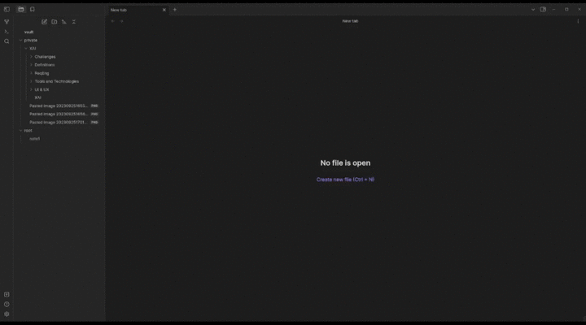

# marco-polo
plugin for obsidian to search for stuff and more



## Get the Plugin as build

```bash
make build
# and see in the dist/ directory
```

extract the archive or copy the resulting folder into the `.obsidian/plugins/` folder.
Don't forget to turn on community-plugins and enable this one.

## How to develop

```bash
make setup
make dev
```

and open `vault/` with obsidian

after changes to `main.ts` use `ctrl-p` to open the command palette and execute `Hot Reload`
